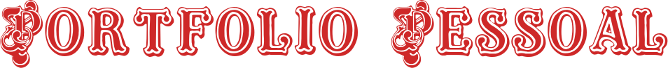

<div id="topo"></div>
<h1 align='center'>
    
    
</h1>
<p align="center"><i>“Step out of line and I'll teach you how to fly" ~Blind Guardian (2006)</i> </p>

<div align="center">
    
    
    
    
    
    
    
</div>


<h3 align='center'>:link:<a href='https://portfolio-carol42.vercel.app/' target='_blank'> Acessar a demonstração (Vercel)</a></h3>

<h4 align="center"> 
    <a href="./README-en.md">Go to the English version of this README »</a>
</h4>
<details>
    <summary>Sumário</summary>
    <ol>
        <li><a href="#pushpin-sobre">Sobre</a></li>
        <li><a href="#hammer_and_wrench-funcionalidades">Funcionalidades</a></li>
        <li><a href="#wrench-tecnologias-e-recursos-utilizados">Tecnologias e recursos utilizados</a></li>
        <li><a href="#computer-como-baixar-e-rodar-o-projeto">Como baixar e rodar o projeto</a>
            <ul>
                <li><a href="#bulb-pré-requisitos">Pré requisitos</a></li>
            </ul>
        </li>
        <li><a href="#woman_technologist-a-desenvolvedora">A desenvolvedora</a></li>
    </ol>
</details>

## :pushpin: Sobre
Este projeto trata-se de um resumo de minha trajetória pessoal e profissional, apresentando meus principais projetos, estudos, experiências e características pessoais.

O layout foi inspirado em uma ficha de personagem comum nos jogos de RPG, como o D&D.

<p align="right"><a href="#topo"></a></p>

## :hammer_and_wrench: Funcionalidades
- Geral
    - [x] Botões para navegar entre as seções
    - [ ] Versão da página em Inglês 
- Seção 1 (Home)
    - [x] Apresentar informações básicas e de contato
    - [x] Barras de progresso indicando o nível de conhecimento / habilidade em cada um dos itens
- Seção 2 (Projetos)
    - [ ] Renderizar um PDF na página com o README de cada projeto

<p align="right"><a href="#topo"></a></p>

## :wrench: Tecnologias e recursos utilizados
- [React.js](https://reactjs.org/)
- [React Router Dom](https://github.com/remix-run/react-router/tree/main/packages/react-router-dom)
- [Styled Components](https://styled-components.com/)
- [Font Awsome](https://fontawesome.com/) (Ícones de redes sociais e do D&D)
- [Font Meme](https://fontmeme.com/dungeons-dragons-font/) (Fonte Dungeons & Dragons utilizada no banner do README)
- [Build your own Octocat](https://myoctocat.com/) (Avatar do perfil)

<p align="right"><a href="#topo"></a></p>

## :computer: Como baixar e rodar o projeto

### :bulb: Pré requisitos

Antes de começar, você vai precisar ter instalado em sua máquina as seguintes ferramentas:
[Git](https://git-scm.com) e [Node.js](https://nodejs.org/en/). 

Além disso, é bom ter um editor para trabalhar com o código como o [VSCode](https://code.visualstudio.com/).

```bash
# Clonar o repositório
$ git clone https://github.com/Carol42/portfolio

# Entrar no diretório
$ cd portfolio

# Instalar as dependências
$ npm install

# Iniciar o projeto
$ npm start
```
<p align="right"><a href="#topo"></a></p>


## :woman_technologist: A desenvolvedora


</br>
<strong>Caroline Heloíse de Oliveira</strong>
</br>
<sup>Estudante de Engenharia de Computação (UEPG)</sup>
</br>
<a href="https://github.com/Carol42"></a>
<a href="https://linkedin.com/in/carol42"></a>
<a href="mailto:carol42.helo@gmail.com"></a>

<p align="right"><a href="#topo"></a></p>


